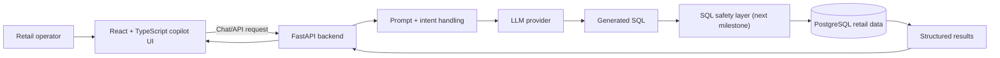

# Proxima360 Retail AI Copilot

Agentic retail analytics assistant for asking business questions in natural language and turning them into useful database-backed answers.

The project is designed around a practical AI-copilot workflow: a business user asks about inventory, sales, or retail performance; the FastAPI backend prepares the LLM prompt, generates SQL for a constrained retail domain, queries PostgreSQL, and returns an answer through a React interface.

## Why this project matters

Retail teams usually need analysts or dashboards for every new question. Proxima360 explores a faster workflow: ask the system directly, let the AI translate intent into a query, and return a business-readable response.

This is the kind of applied LLM system I want to keep building: not just chat, but AI connected to real workflows, data, APIs, and guardrails.

## Current capabilities

- Natural-language questions over retail-style data.
- FastAPI backend for chat and analytics workflows.
- React + TypeScript frontend for a clean copilot experience.
- LLM-assisted SQL generation for inventory and sales questions.
- Configurable local development through `.env` files.
- CI checks for backend syntax, frontend linting, and frontend builds.

## Architecture



## Repository structure

```text
Proxima360_AgenticAi_Chatbot/
├── backend/fastapi_retail_ai/
│   ├── main.py              # FastAPI app and LLM-to-SQL flow
│   ├── requirements.txt     # Python dependencies
│   └── .env.example         # Local config template, no real secrets
├── frontend/proxima360-ai-dialog-main/
│   ├── src/                 # React UI
│   └── package.json
├── .github/workflows/ci.yml # GitHub Actions checks
├── Makefile                 # Local developer commands
└── README.md
```

## Quick start

### Prerequisites

- Python 3.11+
- Node.js 20+
- npm
- PostgreSQL when connecting to a real database
- Your own LLM provider API key

### Configure environment

```bash
git clone https://github.com/riteshdhobale/Proxima360_AgenticAi_Chatbot.git
cd Proxima360_AgenticAi_Chatbot
make setup
```

Then edit:

```text
backend/fastapi_retail_ai/.env
frontend/proxima360-ai-dialog-main/.env
```

Do not commit real `.env` files or API keys.

### Run locally

Use two terminals:

```bash
make backend-dev
```

```bash
make frontend-dev
```

Backend: `http://127.0.0.1:8004`

Frontend: `http://127.0.0.1:8080`

API docs: `http://127.0.0.1:8004/docs`

## Quality checks

```bash
make lint
make build
```

GitHub Actions runs backend syntax checks plus frontend lint/build checks on push and pull request.

## Security and engineering notes

- Secrets belong in local `.env` files or a secret manager, never in source control.
- LLM-generated SQL should be treated as untrusted until validated.
- Production use needs authentication, scoped database roles, CORS restrictions, logging, and query limits.
- The next major engineering step is a proper SQL safety gateway with schema-aware validation.

## High-impact next feature

Build a safe SQL execution gateway:

- Parse generated SQL into an AST.
- Allow only read-only statements.
- Restrict access to approved tables and columns.
- Add row limits and query timeouts.
- Return source table and query provenance with every answer.
- Add an evaluation set of common retail questions.

This would turn the project from a strong AI demo into a more credible applied-LLM system.

## Roadmap

- [ ] Add safe SQL validation and query allowlists.
- [ ] Add a seeded demo dataset and database migrations.
- [ ] Add unit tests for intent handling, SQL generation, and API contracts.
- [ ] Add Docker Compose for frontend, backend, and PostgreSQL.
- [ ] Add screenshots, demo GIF, and a short walkthrough video.
- [ ] Split planner, SQL, analytics, and memory responsibilities into clearer modules.
