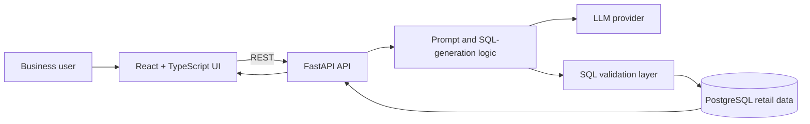

# Proxima360 Retail AI Copilot

A full-stack prototype for asking retail-data questions in natural language. The React interface sends a question to a FastAPI service, which uses an LLM to generate SQL and queries a PostgreSQL-backed retail dataset.

> **Prototype status:** This repository is a proof of concept, not a production-ready analytics platform. Do not point it at production data until SQL access controls, authentication, persistence, and observability are in place.

## What it demonstrates

- Natural-language retail analytics workflows
- LLM-assisted SQL generation for a constrained business domain
- A React + TypeScript client with a FastAPI backend
- Demo-friendly local development with configurable services

## Architecture



## Repository layout

```text
Proxima360_AgenticAi_Chatbot/
├── backend/fastapi_retail_ai/
│   ├── main.py             # FastAPI API and LLM-to-SQL flow
│   ├── requirements.txt
│   └── test_*.py           # manual/integration test scripts
├── frontend/proxima360-ai-dialog-main/
│   ├── src/                # React UI
│   └── package.json
├── Makefile
└── .github/workflows/ci.yml
```

## Quick start

### Prerequisites

- Python 3.11+
- Node.js 18+
- PostgreSQL (only when not using a mock/demo data path)
- An LLM provider API key

### Configure local secrets

```bash
git clone https://github.com/riteshdhobale/Proxima360_AgenticAi_Chatbot.git
cd Proxima360_AgenticAi_Chatbot

cp backend/fastapi_retail_ai/.env.example backend/fastapi_retail_ai/.env
# Add your own TOGETHER_API_KEY and DATABASE_URL. Never commit .env.
```

### Run the backend

```bash
python -m venv .venv
. .venv/bin/activate
pip install -r backend/fastapi_retail_ai/requirements.txt
uvicorn main:app --app-dir backend/fastapi_retail_ai --reload --port 8004
```

### Run the frontend

```bash
cd frontend/proxima360-ai-dialog-main
npm ci
npm run dev
```

The API is available at `http://127.0.0.1:8004`; FastAPI docs are at `/docs`.

## Quality checks

```bash
# Frontend
cd frontend/proxima360-ai-dialog-main
npm run lint
npm run build

# Backend syntax check
python -m compileall -q backend/fastapi_retail_ai
```

CI runs these checks on every push and pull request.

## Security notes

- Keep `TOGETHER_API_KEY` and `DATABASE_URL` in local environment files or a secret manager.
- Use a read-only database role with a tightly scoped schema.
- Treat LLM-generated SQL as untrusted: parse and allowlist read-only statements before execution.
- Restrict CORS and add authentication before deployment.

## Next high-impact feature

Build a **safe SQL execution gateway**: schema-aware retrieval, SQL AST validation, query allowlists, row/time limits, result provenance, and a small evaluation suite of business questions. That turns the project from a visually strong prototype into credible applied-LLM engineering.

## Roadmap

- [ ] Replace in-memory conversation state with persistent, scoped sessions
- [ ] Add database migrations and a seed dataset
- [ ] Add unit/integration tests around SQL safety and API contracts
- [ ] Containerize frontend, API, and PostgreSQL with Docker Compose
- [ ] Add tracing, structured logs, and latency/cost metrics
